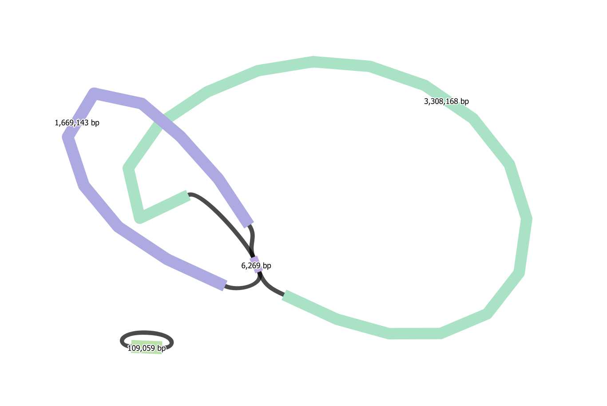
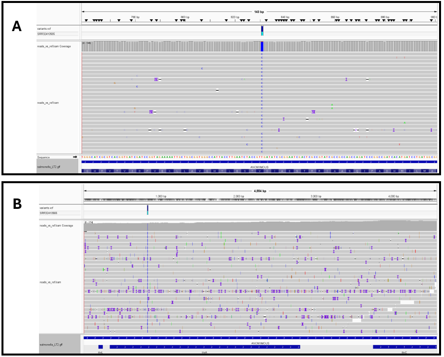
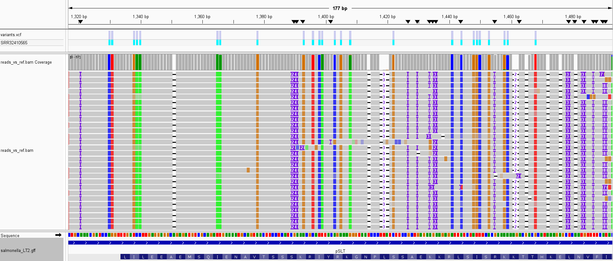

**INTRODUCTION**

_Salmonella_ is a highly prevalent foodborne pathogen which poses great concern to global health. _Salmonella_ can cause conditions such as gastroenteritis which consists of symptoms such as fever, diarrhea and abdominal cramps. There are more than 2600 serotypes of _Salmonella enterica_, each being distinguished by differences in their surface antigens (Mileto _et al._, 2025).

Whole genome sequencing (WGS) has become substantially more affordable and accessible due to the introduction of Next Generation Sequencing (NGS), and due to the overall decrease of sequencing expenses. The use of WGS for _Salmonella_ serotyping offers enhanced discriminatory power, even compared to gold-standard agglutination practices. Prior studies have used WGS for _Salmonella_ serotyping, and have verified its reliability, performance, and applicability. It has been shown to be a viable alternative to other well understood phenotypic methods (Mileto _et al._, 2025). These previous studies display the ability of WGS to yield accurate and high-throughput prediction of serotypes, and in addition, facilitate large-scale epidemiological studies.

Advances in long-read sequencing technologies, such as Oxford Nanopore sequencing, have provided the capability of assembling complete plasmids, which are often difficult to elucidate using short-read data alone. Long-reads are particularly valuable for characterizing genetic elements such as multidrug resistance plasmids, which play a key role in the spread of antimicrobial resistance in bacterial populations (Zhao _et al._, 2023).

Due to the Oxford Nanopore R10 technology, generation of accurate de novo assemblies of bacterial genomes can now be generated using solely long-read data. (Zhao _et al._, 2023). Additionally, with appropriate sequencing depth, Nanopore assemblies reach high accuracy which renders them suitable for epidemiological analyses (Zhao _et al._, 2023). This is a valuable leap in technological capabilities, as it effectively replaces the short/long -read hybrid approaches, which reduces cost and turnaround time.

Genome sequencing does not simply produce a complete and accurate genome. Because the DNA is broken up into various short and imperfect reads which requires careful reconstruction, often by computer. De novo genome assembly is the process of accurately reconstructing the genome, starting with small over-lapping reads (Wick _et al._, 2023). The quality of a specific assembly is described by two factors. The first being accuracy, which describes errors in the assembled sequence, the second is completeness, which describes how fragmented the assembly is relative to the real genome (Wick _et al._, 2023). For bacterial genomes, the desired outcome is one contig per plasmid or chromosome. This, however, is often difficult due to the common presence of repeated sequences, and structural complexity in bacterial genomes. These attributes often lead to ambiguities and errors during assembly. Despite that low-quality assemblies may be applicable for basic tasks, analyses pertaining to mutations, transmission tracking, and whole-genome alignment, demand a highly accurate assembly. This is because even small errors can drastically impact biological interpretations and conclusions (Wick _et al._, 2023).

Oxford Nanopore sequencing yields long-reads which can then be used to assemble bacterial genomes. However, the reads may contain methodologically induced errors, which can affect the accuracy of the assembly downstream. For example, the MinION platform showed a quite high alignment identity, but errors were common, however. The errors mostly consisted of insertions and deletions, with many of them occurring in homopolymer regions (Tyler _et al._, 2018). Wick _et al._ state that although long-reads improve completeness of an assembly, most long-read assemblies still contain errors. Small errors can often be corrected through polishing processes, large structural errors may still exist if introduced during assembly (Wick _et al._, 2023). Because homopolymers are especially difficult for Nanopore sequencing to resolve, further refining and validation steps are necessary to ensure accuracy levels required for genomic analysis (Wick _et al._, 2023).

Short-read and long-read sequencing are typically both used in traditional genome assembly workflows. This is because short-reads have a high base-calling accuracy, and long-reads show overall architecture and continuity over certain repeats or motifs. However, this increases the cost and turnaround time (Zhao _et al._, 2023). Recent experiments using Oxford Nanopore with R10 flow cell produced long-read data with greatly improved accuracy of 98.9%, which allows de novo assembly using long-reads only (Zhao et al., 2023). Utilizing the Flye assembler and Medaka software, bacterial genomes of 5 Mb can reach levels of >99.99% accuracy, yielding a complete genome without the need for short-read data (Zhao et al., 2023). Wick et al. also discuss a long-read workflow where they're used to build the framework of the assembly, followed by polishing procedures to correct remaining errors (Wick _et al._, 2023).

When using Nanopore reads to assemble bacterial genomes, it is necessary to evaluate it's accuracy due to potential inaccuracies being present. To do this, assembled genomes are aligned to a reference genome, of high quality. This provides the standard which is used to identify inaccuracies. Assemblies are compared to the reference genome using sequence alignment. Zhao _et al._ created reference genomes using traditional methods of combining long-read and short-read data, along with multiple rounds of polishing. These constructs are highly accurate and can be taken as an accurate reference (Zhao _et al._, 2023). Nanopore assembled genomes were then aligned to these reference genomes to identify insertions, deletions, and single-nucleotide variations. These constitute the main assembly errors when using Nanopore methods, and counting them describes the accuracy of a given assembly (Zhao _et al._, 2023). Alignment subsequently provides a way to analyze if an assembly, and the following polishing steps, have produced a genome that describes the true sequence (Wick _et al._, 2023).

In this study, Nanopore sequencing data from _Salmonella enterica_ will be utilized to generate a de novo genome assembly, which will then be compared to a reference genome so its accuracy may be evaluated. Long-read sequences will be assembled, followed by polishing steps to reduce errors. The assemblies will then be aligned to a high-quality reference genome obtained form NCBI. Alignment results will then be visualized to allow assessment for both structural, and base-level differences between the constructed assemblies and the reference. This project aims to display how effectively Nanopore based genome assembly can yield reliable and high quality genomes, which are suitable for downstream analysis.

**METHODS**

Genome sequencing data acquisition

Oxford Nanopore long-read whole genome sequencing (WGS) data for _Salmonella enterica_ were obtained from the NCBI Sequence Read Archive (SRA) under the accession SRR32410565. Long-read sequencing has become an increasingly reliable source for bacterial genomics, as the extended read lengths enable improved reconstruction of repetitive regions, compared to short-read methods (Tyler _et al._, 2018; Zhao _et al._, 2023). Raw SRA files were downloaded directly and converted into FASTQ format using the SRA toolkit (fasterq-dump). All downstream analyses were performed on the Compute Canada Narval high-performance computing cluster, using a dedicated Conda environment.

Read quality control and filtering

Initial quality assessment of the raw nanopore reads was performed by using FastQC, which evaluates sequencing quality metrics including per-base quality profiles, nucleotide composition, and GC distribution. As expected for nanopore long-reads, there were observed quality warnings, reflecting the characteristic error of third-generation sequencing platforms (Tyler _et al._, 2018). To improve the accuracy of the assembly, the reads were filtered and trimmed using Cutadapt. Low-quality bases below Q10 were removed, and reads shorter than 1000 base pairs were excluded.

De novo genome assembly

A draft genome was generated using Flye, a long-read assembler designed for noisy nanopore sequencing data. Flye using graph-based approaches and has been shown to work effectively for bacterial genome reconstruction, using nanopore reads alone (Wick _et al._, 2023). The trimmed reads were assembled using --nano-hq preset.

Assembly evaluation and quality assessment

The quality of the assembly was evaluated using QUAST, providing metrics such as genome length, contig count, N50, GC content, and ambiguous base frequency. QUAST is widely used for evaluation bacterial genome completeness and consistency (Wick _et al._, 2023).

Reference genome retrieval

Comparative analysis was performed using the _Salmonella enterica_ serovar Typhimurium LT2 reference genome (NCBI accession GCF\_000006945.2). The reference genome was was downloaded form RefSeq and indexed for alignment.

Read mapping and alignment

Single nucleotide variants relative to the reference genome were identified using Longshot, a variant caller developed for SNP detection form long-read alignments. The trimmed and filtered nanopore reads were mapped to the reference genome to identify SNPs. The reference FASTA was indexed using samtools faidx, and variants were called using the default parameters of Longshot. Variant-based genomic comparison is a widely applied strategy in _Salmonella_ epidemiology, and serotype-level differentiation (Mileto _et al._, 2025).

Visualization

Assembly structure was examined using Bandage, which visualizes assembly graphs and identifies circular replicons. Variant evidence was inspected using IGV, allowing for manual evaluation of read-level support of SNPs for both the chromosome, and the plasmid. Using this workflow for long-read sequencing has been shown as valuable for resolving plasmid-associated variation (Zhao _et al._, 2023; Wick _et al._, 2023)

**RESULTS**

Read preprocessing

Oxford Nanopore long-read sequencing data from _Salmonella enterica_ isolate SRR32410565 were quality asessed and filtered prior to assembly. After trimming (<Q10, and <1000 bp removed) 193,835 reads (98.9%) were retained. This indicates that only a small fraction of the reads failed to pass the quality paramaters. The filtered dataset was used for all downstream analysis.

Genome assembly

De novo assembly with Flye produced a draft genome consisting of three contigs. Two large contigs represented a great majority of the chromosomal sequence, while the third smaller contif (~109 kb) was circularized by the assembler, characteristic of a plasmid element. Visualization of the asdembly graph revealed two major chromosomal compontents (~3.3 and 1.7 Mb) connected by a short linker (~6.3 kb) (Figure 1).

## Figure 1. Assembly graph (Bandage)

**Figure 1. Assembly graph of the _Salmonella enterica_ SRR32410565 draft genome visualized in Bandage.**  
Bandage visualization of the Flye long-read assembly produced from Oxford Nanopore R10 sequencing data. The assembly consists of two large chromosomal contigs (3.31 Mb and 1.67 Mb) connected by an unresolved repeat junction (~6.3 kb), consistent with fragmentation at repetitive genomic regions. A third separate circular contig of 109 kb was recovered, suggesting the presence of an extrachromosomal plasmid replicon. Contig lengths are indicated directly on the assembly graph.

Assembly quality metrics

Assembly evaluation using QUAST reported a total assembled genome length of 5,104,813 bp with a GC content of 52.19%. The assembly was highly contiguous with an N50 of 3,318,776 bp. No ambiguous bases were detected (0 N's per 100 kbp). These metrics indicate a complete bacterial-scale draft genome (REFERENCE) reconstructed using only three contigs.

Alignment to the LT2 reference genome

Trimmed nanopore reads were aligned to the _Salmonella enterica_ Typhimuriu LT2 reference genome (chromosome NC_03197.2 and plasmis NC_003277.2). Read mapping achieved a high alignment rate, with 191,424 reads mapped (94.3%). This supports a storng overall similarity between the sequenced isolate and the reference background.

Variant discovery reltive to the reference

Variant calling with Longshot identified 9,507 total sequence variants in the trimmed reads, compared to the LT2 reference genome. All detected variants were SNPs, with no indels reported. The callset showed a transition/transversion ratio of 1.13.

Variants were unevenly distributed across replicons however. A total of 2,882 SNPs were detected on the LT2 chromosome, while 6,625 SNPs were detected on the plasid contig. This indicated a notably higher rate of polymorphism on the plasmid sequence, opposed to the chromosomal sequence.

Gene-associated SNP visualized in IGV

Representative chromosomal SNP evidence was visualized in IGV. One indluding a variant located within the thrA locus, which encodes a bifunctional enzyme involved in amino acid biosynthesis. Figure 2 shows a zoomed-in view of the read-level support for the alternate allele (Figure 2A) and an overview of the locus (Figure 2B). Plasmid-associated variants dominated the plasmid sequence. Among the plentiful ammount of SNPs observed in the plasmid a SNP overlapping the repC gene, which encodes a replication-associated protein, is visualized in Figure 3.

## Figure 2. Chromosomal SNP in thrA (IGV)

**Figure 2. Chromosomal single nucleotide polymorphism (SNP) relative to the LT2 reference genome detected within the thrA locus.**  
(A) Zoomed-in view of the same locus showing the candidate SNP supported by multiple independent nanopore reads. The alternate allele is visible as a consistent base mismatch relative to the reference sequence, demonstrating strong read-level evidence for chromosomal divergence at a metabolically important gene.
(B) IGV overview of read alignments mapped to the Salmonella enterica serovar Typhimurium LT2 chromosome (NC_003197.2), highlighting a SNP-supported variant site within the genomic region containing thrA, a bifunctional enzyme involved in threonine and methionine biosynthesis. Coverage depth across the region remains consistent, supporting reliable variant detection.

## Figure 3. Plasmid-associated SNP in repC

IGV snapshot of a representative variant identified on the LT2 plasmid contig (NC_003277.2). The SNP overlaps the repC gene, which encodes a replication-associated protein important for plasmid maintenance and copy control. Aligned nanopore reads show strong support for the alternate allele at this position, consistent with elevated plasmid divergence relative to the chromosomal background.

**References**

Mileto, I., Romano, G., Gaiarsa, S., Grassia, G., Bagnarino, J., Piralla, A., Monzillo, V., Cambieri, P., Baldanti, F., & Corbella, M. (2025). Whole genome sequencing as a reliable alternative for salmonella serotyping: A comparative study with the gold-standard method. _Frontiers in Microbiology_, _16_. <https://doi.org/10.3389/fmicb.2025.1685741>

Zhao, W., Zeng, W., Pang, B., Luo, M., Peng, Y., Xu, J., Kan, B., Li, Z., & Lu, X. (2023). Oxford nanopore long-read sequencing enables the generation of complete bacterial and plasmid genomes without short-read sequencing. _Frontiers in Microbiology_, _14_. <https://doi.org/10.3389/fmicb.2023.1179966>

Wick, R. R., Judd, L. M., & Holt, K. E. (2023). Assembling the perfect bacterial genome using Oxford Nanopore and Illumina sequencing. _PLOS Computational Biology_, _19_(3). <https://doi.org/10.1371/journal.pcbi.1010905>

Tyler, A. D., Mataseje, L., Urfano, C. J., Schmidt, L., Antonation, K. S., Mulvey, M. R., & Corbett, C. R. (2018). Evaluation of Oxford Nanopore's minion sequencing device for microbial whole genome sequencing applications. _Scientific Reports_, _8_(1). <https://doi.org/10.1038/s41598-018-29334-5>
